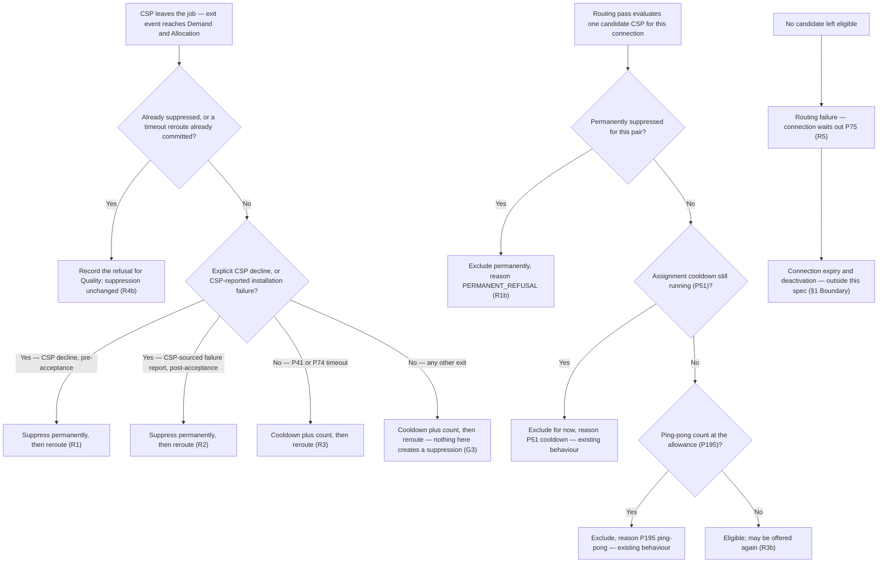

# Do not send the connection again If CSP says 'I can't Install'

*Covers both a decline before acceptance and an installation-failure report after it — either way the CSP has said he cannot install, and either way the connection never goes back to him.*

| | | | |
|---|---|---|---|
| **Owner** — Ashish Raj (PM) | **Reviewer** — Dhruv | **Status** — Signed off | **Sign-off** — Signed off · 30 Jul 2026 |
| **Version** — v1.0 · 30 Jul 2026 | **Consulted — Quality OS** — Akhil (approved 30 Jul 2026) | **Consulted — Demand & Allocation** — Ashish Raj | **Consulted — Connection Lifecycle** — Ashish Raj |

---

## 1. Objective & Definition of Success

**Objective.** A CSP who tells us he cannot do an installation never sees that same connection offered to him again — while a CSP who merely ran out of time still gets one more chance at it.

**Boundary.** When a booking reaches a CSP he can do one of two things: assign a technician to it, or decline it. The customer has already chosen the installation slot at booking time — the CSP does not propose one. This spec governs one decision only: **what the platform does with a (CSP, connection) pair after that CSP leaves the job** — whether the pair is permanently excluded from further routing, or merely cooled down and allowed to return.

It leaves unchanged:
- **The timeouts themselves.** P41 and P74 keep their current windows, anchors, working-hours gating and reroute mechanics (AC-REG-1).
- **Reroute behaviour.** Every refusal and timeout still triggers an immediate reroute exactly as today; this spec adds no delay and removes no reroute (AC-REG-3).
- **The retry counters.** The connection's install-attempt counter (P78) and the allocation's routing-retry counter (P50) are untouched.
- **Quality OS and Enforcement OS scoring.** This spec changes no score. It only guarantees the two signals stay distinguishable (R6).
- **Reason-class routing.** Routing a refusal differently by *which* reason the CSP picked — capability vs customer-claim vs logistics — is explicitly **out of scope**. Here every explicit refusal suppresses, whatever its reason.
- **A cancelled booking.** When the customer cancels, the booking is terminated: Connection Lifecycle moves the connection to pending-deactivation or deactivated, and no new task is ever created for it. Nothing is re-offered to anybody, so suppression has nothing to act on. Entirely out of scope (AC-REG-6).
- **Exits the CSP did not submit.** A P41 or P74 timeout, or a system integrity failure such as a missing device binding, keeps today's behaviour: cooldown, count, and the connection may return (R3, G3). The line is drawn on **who ended the job**, never on the reason given for it.
- **Reason codes are never consulted.** If the CSP submits a decline or an installation-failure report, suppression applies — whatever reason he picked, including one that blames the customer. Reasons are self-reported and unverifiable at the moment they are given, so treating them as facts would let a CSP choose a reason that keeps the connection coming back (G5).
- **Pool exhaustion and expiry.** When suppression leaves no eligible CSP, routing fails as it does today and the connection waits out P75. No new ops signal, no rescue path (R5).

Hard limits: suppression is scoped to a single (CSP, connection) pair and lives only as long as that connection. A per-CSP key is sufficient because an operator and a CSP are a one-to-one mapping — there is no second account through which the same operator could be offered the connection again. It does **not** survive re-booking — see the known limit below.

**Known limit — re-booking resets the promise.** Suppression, the cooldown (P51) and the ping-pong allowance (P195) are all scoped to a single connection, and every new booking creates a new connection. So when a suppressed-and-exhausted connection dies at P75 and the customer books again, all suppression for that address is lost and the same CSP can be offered the same address again. This is accepted for V1. Carrying suppression across re-bookings needs a key that outlives a connection, and the only reliable one across our systems is the customer's normalised mobile number.

### Guardrails — promises that hold on every path

| ID | Guardrail | One line | Anchors |
|---|---|---|---|
| G1 | **An explicit no is final** | Once a CSP explicitly refuses a connection, that connection is never assigned to that CSP again by any route — routing, reallocation, or a manual assignment by operations — except where his refusal commits after a timeout reroute has already committed for the same allocation (R4b). | R1 · R2 · R4 · AC-SUP-1 · AC-SUP-2 · AC-GRD-1 · AC-RACE-1 · MQ-1 |
| G2 | **Silence still gets a second chance** | A P41 or P74 timeout leaves the ping-pong allowance (P195) untouched, so the connection may still return to that CSP once. | R3 · AC-TMO-1 · AC-TMO-3 · AC-CFG-1 · MQ-2 |
| G3 | **Only a CSP's own two actions block** | R1 and R2 are the only rules in this spec that create a suppression, so nothing else can. Every exit the CSP did not submit — a timeout, a system integrity failure, a reason code we have never seen — keeps today's behaviour and can never permanently exclude him. | R1a · R2a · AC-DFL-1 · AC-REG-2 · AC-GRD-2 |
| G4 | **No new cost to the customer** | Suppression never changes when a connection expires. A suppressed-and-exhausted connection follows the same P75 path it follows today. | R5 · AC-REG-1 · MQ-3 |
| G5 | **The reason is never consulted** | Suppression depends only on whether the CSP ended the job himself. No reason code — present or future, blaming the customer or anyone else — changes whether it applies. A CSP cannot pick his way out of it. | R1 · R2 · AC-SUP-8 · AC-GRD-3 |

### Success metrics

Two metrics. Both count the same event — a connection being assigned to a CSP who has already held it — split by what ended his previous hold. M1 is the half that must never happen; M2 is the half that legitimately may.

| ID | Metric | Baseline | Target | Source |
|---|---|---|---|---|
| M1 | Assignments of a connection to a CSP who had already explicitly refused it | **228** in Jun 22 – Jul 20 2026 — 10.3% of all 2,221 re-offers. Of those 228, **53.1% were declined a second time** and exactly **1 (0.4%)** installed. | 0 | MQ-1 |
| M2 | Same-CSP retries — assignments of a connection to a CSP who previously held it, attributable to a P41 or P74 timeout | **1,392** in the same window — 62.7% of all re-offers; **32 (2.3%)** installed | Volume unchanged. Every same-CSP retry traces to a P41 or P74 timeout, and none to an explicit refusal | MQ-1 |

**Invariant (not a metric):** G1 re-offers after an explicit refusal = 0, zero tolerance. Monitored via MQ-1, not trended.

**Note on M1.** MQ-1 counts every re-offer after a refusal, including those caused by the accepted R4b race. Race-caused cases are not separately attributed — a deliberate scope decision — so a non-zero M1 is inspected case by case to separate a genuine breach from an accepted race. M1's target of zero is therefore verified by inspection, not by the count alone.

**Where the baselines come from.** The re-offer cohort table in the CSP decline analysis, Jun 22 – Jul 20 2026 (`decline-signal-analysis.html`, built from `INSTALL_EXECUTION_CANDIDATES` with `_FIVETRAN_ACTIVE = TRUE` and `INSTALL_STATE_TRANSITION_LOG.REASON_CODE`). It takes every re-offered (CSP, connection) pair — the same CSP offered the same connection a second time — and buckets it by what that CSP did on his **first** assignment:

| First-assignment action | Re-offered pairs | 2nd attempt: proposed | 2nd: declined | 2nd: timed out | Installs on 2nd attempt |
|---|---|---|---|---|---|
| Timed out (P41) | 1,392 | 14.7% | 7.3% | 77.9% | 32 (2.3%) |
| Slot proposed (failed downstream) | 601 | 54.7% | 13.0% | 32.1% | 20 (3.3%) |
| Declined | 228 | 9.6% | 53.1% | 37.3% | 1 (0.4%) |
| **All re-offers** | **2,221** | 25.0% | 13.5% | 61.4% | **53 (2.4%)** |

**This table is the empirical case for splitting the two paths.** A re-offer to a CSP who declined installs **0.4%** of the time and is declined again **53.1%** of the time — it mostly just collects a second refusal. A re-offer after a P41 timeout installs **2.3%** of the time, roughly six times better. Suppressing the first while keeping the second is what G1 and G2 encode.

Two limits on the M1 baseline. **228 is a floor, not the full figure**: M1 covers post-acceptance CSP-reported failures as well as pre-acceptance declines, and those are not isolated here — they sit inside the 601 "slot proposed, failed downstream" bucket mixed with causes that are nobody's refusal. And the window is one month, not a rate that has been tracked since. Once MQ-1 exists, M1 is measured directly and both figures should be restated from it.

---

## 2. User Stories & Rules

| ID | Story | MUST | MUST NOT |
|---|---|---|---|
| R1 | As a CSP who declined a booking when it reached me — rather than assigning a technician to it — because I cannot serve that address, I want it gone for good, so that I stop being asked the same question I have already answered. | **(a)** Record a permanent suppression for that (CSP, connection) pair at the moment the decline is accepted, in force before the next routing pass for that connection. **(b)** Exclude that CSP from every subsequent routing pass for that connection, for the life of the connection. **(c)** Reroute the connection immediately, exactly as today — suppression adds no delay. **(d)** Apply the cooldown (P51) and increment the ping-pong count (P195) exactly as today — suppression is additional to them, not a replacement for them. | **(a)** Offer that connection to that CSP again — regardless of how much time has passed, which reason he picked, or how few CSPs remain in the zone. **(b)** Reject, delay or alter the decline submission itself. **(c)** Skip suppression because of the reason he selected. **(d)** Bypass the suppression by any route, including a manual or emergency assignment by operations. |
| R2 | As a CSP who accepted a job by assigning a technician, went out, and reported that the installation could not be completed, I want the same treatment as a decline, so that reporting honestly does not cost me the same booking twice. | **(a)** Record a permanent suppression for that (CSP, connection) pair on an explicit CSP-sourced failure report, in force before the next routing pass for that connection. **(b)** Exclude that CSP from every subsequent routing pass for that connection. **(c)** Leave Connection Lifecycle's install-retry transition and its reroute untouched. **(d)** Apply the cooldown (P51) and increment the ping-pong count (P195) exactly as today, as for R1d. | **(a)** Offer that connection to that CSP again. **(b)** Treat a system-raised failure as if the CSP had reported it (R3, G3). **(c)** Skip suppression because the reason he selected blames the customer, the address, the device or anyone else — the report is his either way (G5). |
| R3 | As the platform, I want a CSP who simply ran out of time to keep his existing second chance, so that we do not punish a busy CSP as if he had refused the work. | **(a)** On a P41 or P74 timeout, apply the assignment cooldown (P51) and increment the ping-pong count exactly as today. **(b)** Allow the connection to return to that CSP while the count is below the allowance (P195). | Create a permanent suppression from a timeout, on any path. |
| R4 | As the platform, I want a predictable outcome when a CSP's refusal and a system timeout land at the same instant, so that neither branch corrupts the other. | **(a)** Apply whichever branch commits first; that branch alone decides the outcome for that allocation. **(b)** Where the timeout branch committed first, still accept and record the CSP's refusal for Quality and Enforcement — without retroactively suppressing. | **(a)** Fail, discard or block the CSP's refusal because a timeout already committed. **(b)** Apply both branches' effects to the same allocation. |
| R5 | As a customer, I want my booking to live exactly as long as it does today, so that this change does not quietly shorten my chance of getting connected. | **(a)** Leave the P75 request window untouched. **(b)** When suppression leaves no eligible CSP, fail routing as today and let the connection wait out P75. | **(a)** Re-include a suppressed CSP in order to avoid an empty pool. **(b)** Shorten or extend the request window because a suppression exists. |
| R6 | As the Quality OS owner, I want to keep seeing refusals and timeouts as separate, labelled signals, so that I can score a silent timeout at least as harshly as a declared refusal. | **(a)** Keep emitting the existing decline-pattern signal for both exit types, with their present type labels and reason codes, unchanged. **(b)** Keep the two types distinguishable end to end. | Merge, relabel or drop either signal as a side-effect of this change. |

**Cross-OS dependency (R6).** This spec makes an explicit refusal operationally *better* for the CSP than going silent: refuse and the booking never returns; stay silent and it returns once. That pull only survives if Quality OS does not penalise the declared refusal more harshly than the silent timeout — the timeout-parity rule. Quality OS is owned outside this spec, and nothing here forces it. What this spec guarantees is that Quality OS has the data to apply parity: both signals continue to arrive, labelled. MQ-2 watches the mix so a scoring rule that cancels the incentive is visible.

---

## 3. System Behaviour

### System flow chart — the sole statement of dispatch order

Two decisions, in evaluation order. The first runs when a CSP leaves a connection; the second runs every time routing considers a candidate for it.

**Precedence — first commit wins (R4).** Where a CSP's refusal and a P41 or P74 timeout race for the same allocation, whichever transaction commits first decides the outcome: if the timeout branch commits first, the allocation is rerouted as a timeout and the later refusal does **not** create a suppression, though it is still recorded for Quality and Enforcement. If the refusal commits first, suppression stands and the timeout branch finds nothing to act on. This is a deliberate, accepted hole in G1 (AC-RACE-1).

**Precedence — suppression outranks every transient check.** Within a single routing pass, the permanent-suppression test runs before the cooldown and ping-pong tests, so a suppressed pair is recorded with the permanent reason rather than a transient one that would later lapse (AC-RACE-2).

---

## 4. Screen Requirements

**Experience intent:** the CSP experiences this as an absence — the booking he refused simply never comes back. Nothing on any screen announces it.

**Master design file:** none — no design work in scope.

**No screen changes.** This feature is behaviour-only, on the PM's explicit decision. No CSP-facing surface, no ops console, no new notification. The only observation surface is the existing routing audit trace, which already records a per-CSP exclusion reason in its decision trace and needs no change beyond carrying the new permanent-refusal reason (R1b).

**Consequence, stated deliberately.** The promise in G1 is never spoken to the CSP. He learns it only by noticing, over repeated bookings, that refused jobs stop returning. Trust therefore accrues slowly and silently, and a CSP who has not noticed the change gets no benefit from it in the meantime. An existing but disabled rail could carry this message if that decision is revisited: the CSP-app Updates feed and CleverTap notification coded for install-booking removal, currently held pending design sign-off on copy, threshold and channel.

---

## 5. Configurability

**This spec introduces no new configuration.** Everything it relies on already exists and is already configurable, owned elsewhere. The two exits that suppress are named in the rules themselves (R1, R2), not held in a list; so are the two timeouts that do not (R3).

### Existing parameters — relied on, not defined here

These already exist and are already configurable. This spec does **not** introduce, redefine, re-scope or change the value of any of them. Values are shown only so the rules and acceptance criteria are readable; the owning OS remains the source of truth, and if a value moves there it moves here with no change to this spec.

| Parameter | What it governs in this spec | Live value | Owner |
|---|---|---|---|
| **P195** — `DAO_N_MAX_SAME_CONNECTION_REASSIGN` | The ping-pong allowance — how many times one connection may be assigned to the same CSP. The second chance G2 preserves (R3b). | 2 | Demand & Allocation (OS Tier 2, calibration) |
| **P51** — `DAO_T_ASSIGNMENT_COOLDOWN` / `P51_DECLINE_COOLDOWN_HOURS` | The assignment cooldown — how long before the same CSP can be re-assigned a connection he left (R3a, R3b). | 4 hours *(confirmed live value. The locked OS docs say 24 h and are stale.)* | Demand & Allocation (OS Tier 3) |
| **P41** — `DAO_T_ACCEPTANCE_WINDOW` / `P41_ACCEPTANCE_WINDOW_HOURS` | The acceptance window: how long the CSP has, after the booking reaches him, to assign a technician or decline. Its expiry is one of the two retrigger-eligible timeouts (R3). | 6 hours *(production, from Parameter Store. The repo default and the locked OS docs both say 2 h and are stale.)* | Demand & Allocation (OS Tier 2) |
| **P74** — install grace (`P74_CONFIG_GRACE`, TAS Clock A) | The grace window anchored on the end of the customer's chosen slot day; its expiry is the other retrigger-eligible timeout (R3). | 96 hours from slot end *(confirmed live value. The repo default says 72 h and is stale.)* | Ashish Raj (Install flow) |
| **P75** — `CL_T_REQUEST_EXPIRY` | How long a connection waits in REQUESTED before expiring — the vacuum path (R5). | 7 days | Connection Lifecycle (OS Tier 2) |

**Interaction note (P195 × P51) — the defect this spec fixes.** Both are existing parameters; the defect is in how they combine, not in either value. The cooldown lapses at P51 (4 hours) but the allowance permits a second assignment up to P195 (2), and the connection can sit in REQUESTED for up to P75 (7 days) — so today there is a window, opening just 4 hours after any exit and lasting until the connection expires, in which the connection is fully eligible to return to the CSP who just left it. Four hours is well inside a single working day: a CSP can refuse a job in the morning and be offered it again the same afternoon. After this spec, that window still exists for timeouts (G2, deliberately) and is closed permanently for explicit refusals (G1) — with **no change to P195 or P51 themselves**. A refusal takes effect before the next routing pass for that connection (R1a, R2a), so no gap exists in which the refusing CSP is transiently eligible.

---

## 6. Measurement

| ID | The system must be able to answer… | Feeds |
|---|---|---|
| MQ-1 | For every assignment of a connection to a CSP who has already held it, which exit ended that CSP's previous hold — an explicit refusal, or a P41 or P74 timeout. Enough detail per case to tell a genuine breach from the accepted R4b race. | M1 (and its invariant) · M2 · G1 · G2 |
| MQ-2 | The mix of CSP exits over time — explicit refusals versus P41 and P74 timeouts — by CSP and by zone, so a Quality OS scoring rule that pushes CSPs back into silence is visible. | G2 · R6 |
| MQ-3 | How many connections reached routing failure with every candidate excluded; for how many of those a permanent suppression was among the exclusion causes; and how many of those ended at P75 expiry rather than recovering. | G4 · R5 |

---

## 7. Acceptance Criteria

**Note on example data.** `zone_002430579` is a real zone — the multi-CSP decline cluster from the Jun–Jul 2026 decline analysis (50 declines, 4 CSPs, 31 bookings) — so the scenarios below run against a real supply shape. `csp-a` … `csp-d` stand in for the four real CSPs of that zone; the names are withheld because this document is public and these are hypothetical refusal scenarios, not records of any CSP's conduct. Connection IDs (`c-88xx`) and the August 2026 dates are invented.

### SUP — Explicit refusal suppresses (R1, R2)

| AC | Given / When / Then | Verifies | Status |
|---|---|---|---|
| AC-SUP-1 | **Given** connection `c-8801` in `zone_002430579` assigned to csp-a on 5 Aug 2026 09:00 IST, **When** csp-a declines it at 09:35 with reason `COVERAGE_NOT_FEASIBLE`, **Then** a permanent suppression exists for (csp-a, `c-8801`) before the next routing pass runs, the connection is rerouted immediately, and csp-a is excluded from that pass with the permanent-refusal reason. | R1a · R1b · R1c · R1d · R1 must-not (b) · G1 | Settled |
| AC-SUP-2 | **Given** connection `c-8802` accepted by csp-b — technician assigned — for the customer's chosen slot of 6 Aug 2026, **When** csp-b reports the installation could not be completed with reason `BACKHAUL_ISSUE`, **Then** a permanent suppression exists for (csp-b, `c-8802`), CL's retry path runs and reroutes as before, and csp-b is excluded from every later pass for `c-8802`. | R2a · R2b · R2c · R2d · R2 must-not (a) · G1 | Settled |
| AC-SUP-3 | **Given** the suppression from AC-SUP-1, **When** routing runs again for `c-8801` on 12 Aug 2026 — seven days later, well past P51 (4 h), with the ping-pong count at 1, below P195 (2) — **Then** csp-a is still excluded, with the permanent-refusal reason and not a cooldown or ping-pong reason. | R1b · R1 must-not (a) · G1 | Settled |
| AC-SUP-4 | **Given** connection `c-8803` in `zone_002430579` where csp-a, csp-c and csp-d have all explicitly declined and are the zone's only eligible CSPs, **When** routing runs, **Then** routing fails with no candidate eligible and no suppressed CSP is re-included to fill the gap. | R5b · R5 must-not (a) · G1 · G4 | Settled |
| AC-SUP-5 | **Given** connection `c-8804` assigned to csp-d, **When** csp-d declines with reason `SCHEDULE_CONFLICT` — a logistics reason, not a capability one — **Then** the suppression is permanent exactly as for `COVERAGE_NOT_FEASIBLE`: reason class does not soften it (§1 Boundary). | R1a · G1 | Settled |
| AC-SUP-6 | **Given** the suppression from AC-SUP-1, **When** `c-8801` is later re-routed by a system-structural reallocation rather than a refusal or timeout, **Then** csp-a is still excluded with the permanent-refusal reason — suppression holds on every routing path, not only the refusal path. | R1b · G1 | Settled |
| AC-SUP-7 | **Given** connection `c-8805` that csp-c let lapse on a P41 timeout on 5 Aug 2026 and that csp-a then declined on 6 Aug, **When** routing runs on 8 Aug, **Then** only csp-a is permanently excluded; csp-c is excluded only if his cooldown or allowance says so, and is eligible once P51 has elapsed. | R1a · R3b · G1 · G2 | Settled |
| AC-SUP-8 | **Given** connection `c-8820` assigned to csp-a with the booking still live, **When** csp-a reports the installation failed and selects reason `CUSTOMER_REFUSED` — blaming the customer for turning the technician away — **Then** a permanent suppression exists for (csp-a, `c-8820`) exactly as for any other reason: csp-a submitted the report, so it is his refusal, and he is never offered `c-8820` again. | R2a · R2 must-not (c) · G1 · G5 | Settled |
| AC-SUP-9 | **Given** csp-a permanently suppressed on `c-8801` and the connection sitting unassigned with no eligible CSP left, **When** operations attempt to assign it to csp-a by hand — the case where a human can see the connection is stuck — **Then** the assignment is refused: there is no operational override, and the connection waits out P75 instead. | R1 must-not (d) · G1 · G4 | Settled |

### TMO — Timeout keeps the second chance (R3)

| AC | Given / When / Then | Verifies | Status |
|---|---|---|---|
| AC-TMO-1 | **Given** connection `c-8810` assigned to csp-c at 5 Aug 2026 10:00 IST, with csp-c neither assigning a technician nor declining, **When** P41 (6 h) elapses at 16:00 and the timeout reroute runs, **Then** the cooldown and ping-pong count are applied as today, **no** suppression exists for (csp-c, `c-8810`), and the connection is rerouted. | R3a · R3 must-not · G2 · P41 | Settled |
| AC-TMO-2 | **Given** the timeout from AC-TMO-1 with the ping-pong count at 1, **When** routing runs for `c-8810` at 14:30 on 5 Aug 2026 — after P51 (4 h) has elapsed — **Then** csp-c is eligible again and may be assigned the connection a second time. | R3b · G2 | Settled |
| AC-TMO-3 | **Given** connection `c-8811` accepted by csp-b — technician assigned — for the customer's chosen slot of 5 Aug 2026, with no ISP config submitted, **When** the grace clock fires at slot end plus P74 (96 h) and the system raises the install failure, **Then** it is treated as a timeout — cooldown and count, no suppression — even though it arrives as the same failure-report event a CSP's own report would produce. | R3a · R2 must-not (b) · G2 · P74 | Settled |
| AC-TMO-4 | **Given** connection `c-8812` where csp-c has now timed out twice, taking the ping-pong count to 2, **When** routing runs, **Then** csp-c is excluded with the existing ping-pong reason — unchanged from today, and not the permanent-refusal reason. | P195 · G2 | Settled |

### DFL — Exits the CSP did not submit (G3)

| AC | Given / When / Then | Verifies | Status |
|---|---|---|---|
| AC-DFL-1 | **Given** connection `c-8821` assigned to csp-d, **When** the install fails with `BINDING_MISSING` — a device-binding integrity failure, not a CSP decision — **Then** no suppression is created, and the reason is still recorded so it stays visible for later analysis. | G3 | Settled |

### WF — Workflows

| AC | Given / When / Then | Verifies | Status |
|---|---|---|---|
| AC-WF-1 | **Given** connection `c-8830` in `zone_002430579` newly requested on 5 Aug 2026, **When** csp-a declines it at 09:35 (`COVERAGE_NOT_FEASIBLE`), it reroutes to csp-c who lets the P41 window lapse, it reroutes again to csp-b who accepts and installs on 7 Aug, **Then** `c-8830` is active, csp-a was never offered it again at any point, and csp-c remained eligible throughout with a ping-pong count of 1. | R1b · R3b · G1 · G2 | Settled |
| AC-WF-2 | **Given** connection `c-8831` in a two-CSP zone, **When** both csp-a and csp-d explicitly decline it on 5 Aug 2026, **Then** routing fails with every candidate permanently excluded, the connection stays in REQUESTED, and it expires at P75 (7 days) on 12 Aug 2026 without either CSP being offered it again. | G1 · G4 · R5b · R5 must-not (b) | Settled |

### REG — Regression (§1 Boundary)

| AC | Given / When / Then | Verifies | Status |
|---|---|---|---|
| AC-REG-1 | **Given** the P41 and P74 timers as configured today, **When** this spec ships, **Then** both fire at the same deadlines, with the same anchors and the same working-hours gating as before, and P75 expiry is unchanged. | R5a · §1 Boundary · G4 | Settled |
| AC-REG-2 | **Given** the exits the CSP did not submit — a P41 timeout, a P74 timeout, a missing device binding — **When** each occurs, **Then** each behaves exactly as it does today. | §1 Boundary · G3 | Settled |
| AC-REG-3 | **Given** any refusal or timeout, **When** it is processed, **Then** the reroute happens at the same point and with the same immediacy as today, and the two retry counters (P78 on the connection, P50 on the allocation) move exactly as they do today. | §1 Boundary · R1c · R2c | Settled |
| AC-REG-4 | **Given** a decline and a P41 timeout, **When** each is processed, **Then** the existing decline-pattern signal is emitted for both, with its present type labels and reason codes unchanged, and both remain distinguishable to Quality OS. | R6a · R6b · R6 must-not | Settled |
| AC-REG-5 | **Given** csp-a permanently suppressed on `c-8801`, **When** routing runs for a different connection `c-8899` in the same zone on the same day, **Then** csp-a is fully eligible for `c-8899` — suppression never leaks beyond the connection it was recorded against. | R1b · §1 Boundary | Settled |
| AC-REG-6 | **Given** connection `c-8898` assigned to csp-a on 5 Aug 2026, **When** the customer cancels the booking, **Then** the connection moves to pending-deactivation or deactivated, no task is created for any CSP, no reroute occurs, and no suppression is recorded — the cancel path is untouched by this spec. | §1 Boundary | Settled |

### RACE — Precedence (§3)

| AC | Given / When / Then | Verifies | Status |
|---|---|---|---|
| AC-RACE-1 | **Given** connection `c-8850` assigned to csp-d with the P41 window expiring at 12:00:00 on 5 Aug 2026, **When** the timeout reroute commits at 12:00:00 and csp-d's decline commits at 12:00:01, **Then** the allocation is rerouted as a timeout, **no** suppression is created for (csp-d, `c-8850`), the decline is still recorded for Quality and Enforcement, and the connection may later return to csp-d once — the accepted hole in G1. | R4a · R4b · R4 must-not (a) · R4 must-not (b) · G1 exception | Settled |
| AC-RACE-2 | **Given** connection `c-8851` where csp-a is both permanently suppressed and inside the P51 cooldown window, **When** a routing pass evaluates him, **Then** he is excluded with the permanent-refusal reason, not the transient cooldown reason — so the exclusion does not appear to lapse when the cooldown does. | §3 precedence · R1b | Settled |

### DUP — Duplicate triggers

| AC | Given / When / Then | Verifies | Status |
|---|---|---|---|
| AC-DUP-1 | **Given** the suppression from AC-SUP-1, **When** a duplicate decline event for (csp-a, `c-8801`) is delivered again, **Then** the suppression is unchanged, the ping-pong count does not move a second time, and no second reroute is triggered. | R4b | Settled |
| AC-DUP-2 | **Given** connection `c-8852` where csp-b reported failure and was suppressed, **When** csp-b submits a second failure report for the same connection, **Then** the report is accepted and recorded, and suppression is unchanged. | R4b | Settled |

### BV — Boundary values

| AC | Given / When / Then | Verifies | Status |
|---|---|---|---|
| AC-BV-1 | **Given** csp-c timed out on `c-8860` at 10:00 on 5 Aug 2026, **When** routing runs at 13:59 on 5 Aug — one minute inside P51 (4 h) — **Then** he is excluded with the cooldown reason. | P51 · G2 | Settled |
| AC-BV-2 | **Given** the same timeout on `c-8860`, **When** routing runs at 14:01 on 5 Aug — one minute outside P51 (4 h) — **Then** he is eligible again. | P51 · G2 | Settled |
| AC-BV-3 | **Given** the ping-pong allowance P195 at its default of 2 and csp-c's count at 1 for `c-8861`, **When** routing runs after the cooldown lapses, **Then** he is eligible and may be offered the connection a second time. | P195 · R3b · G2 | Settled |
| AC-BV-4 | **Given** csp-c's count at 2 for `c-8861` — at the allowance P195 (2) — **When** routing runs after the cooldown lapses, **Then** he is excluded with the ping-pong reason. | P195 · G2 | Settled |
| AC-BV-5 | **Given** csp-a declined `c-8862` one second ago, **When** the very next routing pass for `c-8862` runs, **Then** he is already excluded — suppression is in force with no transient window of eligibility. | R1a · R1b · G1 | Settled |

### CFG — Configurability

| AC | Given / When / Then | Verifies | Status |
|---|---|---|---|
| AC-CFG-1 | **Given** P195 lowered from 2 to 1, **When** csp-c times out once on `c-8870` and the cooldown lapses, **Then** he is excluded with the ping-pong reason and the connection never returns to him — the timeout second chance is configurable away without touching suppression. | P195 · G2 | Settled |

### GRD — Guardrails

| AC | Given / When / Then | Verifies | Status |
|---|---|---|---|
| AC-GRD-1 | **Given** the four CSPs of `zone_002430579` across 31 bookings over a month, **When** every explicit refusal in that period is replayed, **Then** no connection is ever assigned to a CSP who had already explicitly refused that same connection — except cases attributable to the R4b race, which are individually identifiable. | G1 · M1 · MQ-1 | Settled |
| AC-GRD-2 | **Given** any exit the CSP did not submit himself, **When** it is processed on any path, **Then** no permanent suppression is created. | G3 | Settled |
| AC-GRD-3 | **Given** every reason code a CSP can select on a decline or an installation-failure report — including any added later — **When** he submits one, **Then** a permanent suppression is created in every case: no reason code changes the outcome. | G5 · R1 must-not (c) · R2 must-not (c) | Settled |

---

## 8. Glossary

| Term | Meaning | Owner (domain) |
|---|---|---|
| Exit | **Canonical definition:** any event that ends a CSP's hold on a connection while that connection is still live and still needs installing, so it returns to routing for someone else. Exits come in two kinds, and telling them apart is what this whole spec does: those the CSP **submitted himself** — a decline, or an installation-failure report, together an *explicit refusal* — and those **raised by the platform** — a P41 or P74 timeout, or a system integrity failure. Two things are not exits: a completed installation, and the customer cancelling the booking (that ends the booking itself, so nothing returns to routing — §1 Boundary). | — |
| Explicit refusal | **Canonical definition:** a CSP's own declared statement that he will not or cannot do this installation — either a decline raised when the booking reached him — instead of assigning a technician — or an installation-failure report raised by him after he accepted it. Distinguished from every system-raised exit by the fact that the CSP chose to submit it. **The reason he attaches is not part of the definition** — a report blaming the customer is still his report (G5). Only an explicit refusal creates a suppression (R1, R2, G1). All other mentions cite this definition. | — |
| Suppression | **Canonical definition:** a permanent record that one connection must never again be offered to one CSP, held against the (CSP, connection) pair and lasting as long as that connection exists. Distinct from the cooldown, which lapses, and from the ping-pong allowance, which counts. | Demand & Allocation |
| Offer | One connection put to one CSP for acceptance. What the platform must know about it: which CSP, which connection, how many times this pair has been offered, when the CSP last left it, and whether a suppression exists. Begins when Demand & Allocation assigns the connection to that CSP; ends when the connection ends. How this is modelled or stored is the implementer's. | Demand & Allocation |
| Ping-pong allowance | The cap on how many times one connection may be assigned to the same CSP over its life — P195. Existing mechanism, unchanged by this spec except that a suppressed pair is excluded before it is consulted. | Demand & Allocation |
| Assignment cooldown | The minimum wait before a CSP can be re-assigned a connection he previously left — P51. Transient: it lapses. Existing mechanism, unchanged. | Demand & Allocation |
| Service vacuum | The state of a connection that no CSP is eligible to take: routing fails, the connection stays in REQUESTED, and nothing acts on it until it expires at P75. Pre-existing behaviour; this spec makes it more reachable and deliberately does not change it (R5, G4). | Connection Lifecycle |
| First commit wins | **Canonical definition:** where a CSP's refusal and a system timeout act on the same allocation at the same instant, the transaction that commits first determines the outcome and the other has no effect on suppression (R4, AC-RACE-1). | — |
| Timeout parity | The rule that a silent timeout must be scored at least as harshly as a declared refusal, so that declaring honestly is never the more expensive choice for a CSP. Applies to Quality OS scoring, which is outside this spec; this spec only guarantees the data for it (R6). | Quality OS |

---

## 9. Notes for System Capabilities

What the platform must be able to do for this feature to exist. Whether these are one system or several, and how they interact, is the implementer's design.

| Capability | Needed by |
|---|---|
| Distinguish an explicit CSP refusal from a system-raised exit at the point where re-routing is decided — including telling a CSP's own installation-failure report apart from a P74 grace timeout, which arrives as the same event. | R1 · R2 · R3 |
| Hold a permanent exclusion against a (CSP, connection) pair for the life of that connection, and consult it in every routing pass before any transient check. | R1b · R2b · G1 · §3 precedence |
| Tell an exit the CSP submitted from one raised by a clock or another system, and decide suppression on that alone, without reading the reason code. | G3 · G5 |
| Make a recorded suppression effective before the next routing pass for that connection, with no window in which the refusing CSP is transiently eligible. | R1a · R1b · AC-BV-5 |
| Accept and record a refusal that cannot suppress because a timeout reroute already committed, without losing the refusal. | R4b · G3 |
| Report, per exclusion, which rule excluded a CSP — permanent refusal, cooldown, or ping-pong — durably enough to answer MQ-1 and MQ-3 after the fact. | MQ-1 · MQ-3 · M1 · M2 · AC-RACE-2 |
| Report the mix of CSP exits by type, CSP and zone over time. | MQ-2 · M2 · R6 |
| Keep emitting both exit signals, labelled and distinguishable, to Quality OS and Enforcement OS. | R6 · AC-REG-4 |

---

## Overrides

| Rule | What was done instead | Rationale | Approved by |
|---|---|---|---|
| Template §7 requires a Race AC per precedence rule, and §1 guardrails should hold on every path | G1 carries a documented exception rather than holding unconditionally | PM chose first-commit-wins (Q6b) over explicit-action-wins. The hole is named in G1, §3 and AC-RACE-1 rather than hidden. | Ashish Raj, 29 Jul 2026 |
| Template §6 expects every accepted risk to trace to an MQ | The R4b race has no dedicated measurement question | PM removed the race-frequency MQ (Q8). MQ-1 counts race-caused re-offers without separately attributing them; M1 carries a note that its zero target is verified by case inspection. | Ashish Raj, 29 Jul 2026 |
| Template §4 expects screen requirements where a user-facing promise exists | No screens; the G1 promise is never communicated to the CSP | PM chose behaviour-only (Q7). Consequence stated in §4. | Ashish Raj, 29 Jul 2026 |
| Template §3b requires a state transition table as the document's canon, and §7 requires a state-change AC per transition | **§3b is removed entirely.** §3 is now the dispatch chart plus its precedence rules; behaviour lives in §2 as lettered obligations, and every AC anchors to a rule, guardrail or parameter instead of a transition. | PM instruction: a PRD should not define what the states are. The removed table also invented six state names (OFFERED, BLOCKED_PERMANENT, COOLING, RETRIABLE, BLOCKED_EXHAUSTED, CLOSED) that exist in no service — naming them here risked being read as prescribing a state machine to D&A. The cooldown-and-count-still-apply obligation survived as R1d and R2d. The old table's failure envelope was first carried over as a rule, then dropped on PM review along with its criterion — see the failure-window override below. | Ashish Raj, 30 Jul 2026 |
| Template §1/§6 require every guardrail to trace to a measurement question | **G3 and G5 trace to none.** Both are enforced by their acceptance criteria and by construction — R1 and R2 are the only rules that create a suppression — but nothing measures them after launch. | PM removed the measurement question that covered both. The residual risk: if a future change ever made something other than a CSP's own decline or failure report create a suppression, or made a reason code matter, no report would surface it. It would show up as CSPs quietly losing work, found by complaint rather than by monitoring. Accepted. | Ashish Raj, 30 Jul 2026 |
| Template §7 requires a failure-window acceptance criterion in every PRD | **There is none, and no rule about failure either.** What happens if the platform cannot record a suppression is left entirely to engineering. | PM removed the failure-window criterion and then the rule behind it. Both were mine, carried over from the deleted state table rather than elicited, and neither was asked for. The residual risk is stated rather than hidden: if a suppression write fails silently and the system defaults to *suppressed*, a CSP is locked out of a job he never refused — the exact inverse of this spec's purpose. Engineering should default to un-suppressed when a suppression record is in doubt. | Ashish Raj, 30 Jul 2026 |
| Template v3 defines §1–§9 plus the review and Overrides sections; it has no Code evidence appendix | A **Code evidence** appendix is added at the end, citing file and line for every claim this document makes about *current* behaviour. | Six statements of current behaviour in this spec are things no reader can check from the OS docs — three of the five parameter values in §5 contradict the locked OS, P74 has moved service, and acceptance is no longer a slot proposal. Without citations a reviewer would re-derive the wrong values from the OS and reject correct rules. The appendix adds no obligation; it only shows the working. | Ashish Raj, 30 Jul 2026 |
| Template §5 expects a Configurability table of C-ids this document owns, and §7 expects a CFG acceptance criterion per runtime-changeable one | **This PRD defines no C-ids at all.** §5 lists only the existing parameters it relies on (P41, P51, P74, P75, P195), by their real OS ids, with no range and no claim of ownership. The single CFG criterion left tests an existing parameter (P195), not one this spec introduces. | PM instruction, in two steps: first, where configurability already exists, do not restate it as a new requirement — ping-pong and the cooldown are D&A-owned. Then: drop the four new settings too, because the spec only has to say that an explicit decline or a reported installation failure stops the connection coming back. The triggers are named in R1 and R2, the timeouts in R3; a list would add a moving part without adding a decision. | Ashish Raj, 30 Jul 2026 |

---

## Code evidence

Verified 29–30 Jul 2026 against `csp-os-yaml`, `qa` branch. Every claim this document makes about *current* behaviour traces to a citation here.

- **All four exits are treated identically today.** `AllocationServiceImpl.declineAllocation` (L181–206), `AllocationServiceImpl.applyAcceptanceTimeoutReroute` (L150–156) and `InboundEventProcessingServiceImpl.handleClStateChanged` (L502–511) each call `addDeclineCooldown` + `incrementAssignmentCount`. This is the defect.
- **Ping-pong is P195.** `DAO_N_MAX_SAME_CONNECTION_REASSIGN`, default 2, per-connection, Tier 2 — `Demand_Allocation_OS_v1_9_1_LOCKED.md:572`. Enforced in `RoutingEngineServiceImpl.isPingPongLimitReached` (L312–332).
- **P51 is 4 hours in the service, not the 24 the OS documents.** `DemandAllocationParameters.p51DeclineCooldownHours = 4` (L87, constrained `@Min(0) @Max(48)`); `application-local.yml:48` sets 4; `application.yml:79` binds production to `${P51_DECLINE_COOLDOWN_HOURS}` from Parameter Store with no in-repo fallback, so the live value is not visible in the repo. Both locked OS docs (`Demand_Allocation_OS_v1_9_1_LOCKED.md:566`, `SPR_v1_21_LOCKED.md:174`) still say 24 hours. §5 follows the code. This matters to the argument, not just the number: at 4 hours a CSP can refuse a job in the morning and be offered the same job back the same afternoon.
- **P74 is no longer a Connection Lifecycle timer.** `ConnectionTimeoutScheduler` L80–94 — `case PENDING_INSTALL -> Optional.of(P74)` is commented out; ownership moved to `csp-tas-service` Clock A (`ReminderType.P74_CONFIG_GRACE`, anchored on the end of the customer's slot day, 23:59:59 IST, plus the grace window).
- **A P74 timeout and a CSP's own failure report are the same event.** `CandidateWorkflowServiceImpl.failBySystemTimeout` L1939–1958 emits `ES_INSTALL_REPORTED_FAILED` on Clock A miss — the same event the CSP's report produces.
- **The distinction already travels to Demand & Allocation, which currently ignores it.** The contract it consumes (`ClStateChanged`) already carries the system-versus-CSP distinction — TAS's copy documents the purpose verbatim: *"Used to distinguish a SYSTEM-driven install timeout from a CSP/CUSTOMER-reported failure."* Demand & Allocation reads only the CSP id and the entry reason today. So no new producer-side work is needed for R1 and R2. **Which value carries it, and how it is made trustworthy, is engineering's to decide.**
- **P41 is separately distinguishable.** `ClSystemAcceptanceTimeout.REASON_TIMEOUT_P41`; reroute driven by `ES_INSTALL_CANCELLED_BY_UPSTREAM(TIMEOUT_P41)`.
- **Who submitted an exit is already recorded separately from the reason given.** Picker-driven submissions and clock- or integrity-driven ones arrive through different code paths and are already labelled differently (`EsInstallReportedFailedGap03Test` asserts the picker mapping for `COVERAGE_NOT_FEASIBLE`, `SCHEDULE_CONFLICT`, `DEVICE_UNAVAILABLE`, `BACKHAUL_ISSUE`; `failBySystemTimeout` labels its own emissions). That separation is what makes R1 and R2 implementable at all: the reason is the CSP's own unverifiable claim, whereas the path an exit arrived on is not his to choose. Note the label is currently derived from a code the CSP app sends, so whether that derivation is a safe trust boundary is engineering's to establish.
- **The install-failure handler never inspects the reason.** `InboundEventProcessingServiceImpl.handleInstallationFailed` L433–485 branches only on P78 exhaustion — so `CUSTOMER_REFUSED` and every other preserved reason drives the retry transition and a reroute just like any other. That is convenient here: the reroute is uniform, and the only thing this spec adds is a check on **who submitted the exit**, not on which reason came with it (AC-SUP-8, AC-GRD-3).
- **A cancelled booking never reaches that handler.** Customer cancellation runs the Connection Lifecycle deactivation path (pending-deactivation / deactivated) and creates no new task (AC-REG-6).
- **The three per-stage reroute-timeouts are off in production.** `application-prod.yml` L50–52 pins `SCHED_AWAITING_TECHNICIAN_ASSIGNMENT_RT_ENABLED`, `SCHED_TECHNICIAN_ASSIGNED_RT_ENABLED` and `SCHED_ARRIVED_AT_SITE_RT_ENABLED` to `false`, pending ETA calibration — which is why R3 names only P41 and P74 today. If one of those flags is turned on, R3 and G3 decide what happens: a system clock is not a refusal, so it must not suppress.
- **Single-CSP fallback was already removed for install failure.** `RoutingEngineServiceImpl` L121–129 — a P51/P195-excluded CSP is never re-included; a single-CSP zone produces `LOOP_EXHAUSTED` and the connection waits out P75. This spec extends that to declines and deliberately leaves the vacuum unchanged (R5, G4).
- **Acceptance is the technician assignment, not a slot proposal.** `AllocationServiceImpl.acceptOnTechnicianAssignment` (L76–99) drives `ASSIGNED → ACCEPTED` and logs it as the *"customer-scheduled anchor"*; its own comment records that the slot-proposal route is the **legacy** one — *"Legacy flows only assign a technician AFTER acceptance already latched (post-proposal)"* (L78–80). `acceptOnSlotProposal` (L58–72) survives only for those legacy rows and for idempotency. So on the current flow the customer picks the slot at booking and the CSP's only two moves are assign-a-technician or decline. Note the state and event names still say slot — `AWAITING_SLOT_PROPOSAL`, `ES_INSTALL_SLOT_SELECTED` — a naming lag, not a behaviour this spec relies on.
- **All three install-flow time values are Parameter Store overrides, and every in-repo default is stale.** P41 — `application.yml:56` binds `${P41_ACCEPTANCE_WINDOW_HOURS}` with no fallback; repo default and `SPR_v1_21_LOCKED.md:164` both say 2 h, live is **6 h**. P51 — `application.yml:79` binds `${P51_DECLINE_COOLDOWN_HOURS}` with no fallback; repo default says 4 h, `SPR_v1_21_LOCKED.md:174` says 24 h, live is **4 h**. P74 — `csp-tas-service/application.yml:369` binds `${P74_CONFIG_GRACE_HOURS:72h}`; repo default says 72 h, live is **96 h**. All three live values came from the PM, not the repo. **Do not read these three from the repo or the locked OS docs — read them from Parameter Store.** P75 `CL_T_REQUEST_EXPIRY` 7 days Tier 2 (`SPR_v1_21_LOCKED.md:234`) is not known to have drifted.
