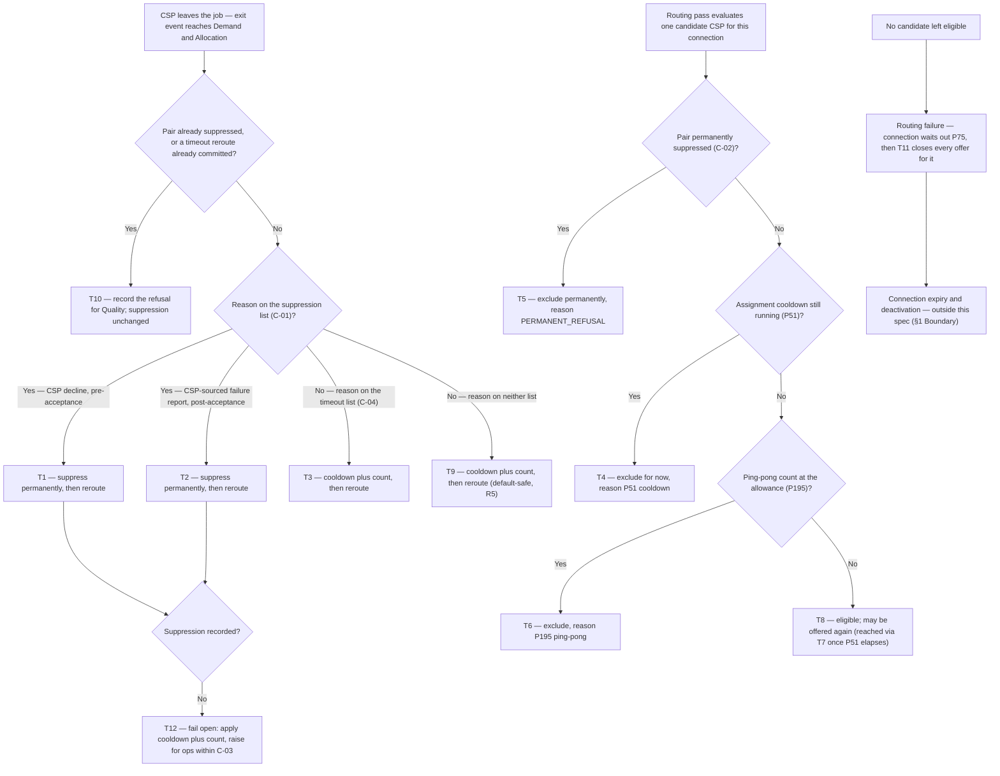

# Decline & Retrigger — respecting an explicit CSP refusal

| | | | |
|---|---|---|---|
| **Owner** — Ashish Raj (PM) | **Reviewer** — [to be named] ⚠️ *AI GENERATED — review* | **Status** — Draft | **Sign-off** — Pending |
| **Version** — v0.1 · 29 Jul 2026 | **Consulted — Quality OS** — Vaibhav | **Consulted — Demand & Allocation** — [to be named] ⚠️ *AI GENERATED — review* | **Consulted — Connection Lifecycle** — [to be named] ⚠️ *AI GENERATED — review* |

---

## 1. Objective & Definition of Success

**Objective.** A CSP who tells us he cannot do an installation never sees that same connection offered to him again — while a CSP who merely ran out of time still gets one more chance at it.

**Boundary.** This spec governs one decision only: **what the platform does with a (CSP, connection) pair after that CSP leaves the job** — whether the pair is permanently excluded from further routing, or merely cooled down and allowed to return.

It leaves unchanged:
- **The timeouts themselves.** P41 and P74 keep their current windows, anchors, working-hours gating and reroute mechanics (AC-REG-1).
- **Reroute behaviour.** Every refusal and timeout still triggers an immediate reroute exactly as today; this spec adds no delay and removes no reroute (AC-REG-3).
- **The retry counters.** The connection's install-attempt counter (P78) and the allocation's routing-retry counter (P50) are untouched.
- **Quality OS and Enforcement OS scoring.** This spec changes no score. It only guarantees the two signals stay distinguishable (R7).
- **Reason-class routing.** Routing a refusal differently by *which* reason the CSP picked — capability vs customer-claim vs logistics — is explicitly **out of scope**. Here every explicit refusal suppresses, whatever its reason.
- **A cancelled booking.** When the customer cancels, the booking is terminated: Connection Lifecycle moves the connection to pending-deactivation or deactivated, and no new task is ever created for it. Nothing is re-offered to anybody, so suppression has nothing to act on. Entirely out of scope (AC-REG-6).
- **Customer-driven and system-integrity exits that still re-route.** Distinct from the above: where the booking stays live and the CSP reports a failure — the customer turned the technician away, verification failed, access was denied, the device binding was missing — the connection does re-enter routing. These keep today's behaviour (R5).
- **Pool exhaustion and expiry.** When suppression leaves no eligible CSP, routing fails as it does today and the connection waits out P75. No new ops signal, no rescue path (R6).

Hard limits: suppression is scoped to a single (CSP, connection) pair (C-02) and lives only as long as that connection. It does **not** survive re-booking — see the known limit below.

**Known limit — re-booking resets the promise.** Suppression, the cooldown (P51) and the ping-pong allowance (P195) are all scoped to a single connection, and every new booking creates a new connection. So when a suppressed-and-exhausted connection dies at P75 and the customer books again, all suppression for that address is lost and the same CSP can be offered the same address again. This is accepted for V1 (C-02). Carrying suppression across re-bookings needs a key that outlives a connection, and the only reliable one across our systems is the customer's normalised mobile number.

### Guardrails — promises that hold on every path

| ID | Guardrail | One line | Anchors |
|---|---|---|---|
| G1 | **An explicit no is final** | Once a CSP explicitly refuses a connection, that connection is never assigned to that CSP again — except where his refusal commits after a timeout reroute has already committed for the same allocation (R4b). | R1 · R2 · R4 · AC-SUP-1 · AC-SUP-2 · AC-GRD-1 · AC-RACE-1 · MQ-1 |
| G2 | **Silence still gets a second chance** | A P41 or P74 timeout leaves the ping-pong allowance (P195) untouched, so the connection may still return to that CSP once. | R3 · AC-TMO-1 · AC-TMO-3 · AC-CFG-1 · MQ-2 |
| G3 | **An unknown reason never blocks** ⚠️ *AI GENERATED — review* | Any exit reason not on the suppression list (C-01) keeps today's behaviour. A new, renamed or unrecognised reason code can never permanently exclude a CSP. | R5 · AC-DFL-1 · AC-DFL-3 · AC-REG-2 · AC-GRD-2 · MQ-5 |
| G4 | **No new cost to the customer** ⚠️ *AI GENERATED — review* | Suppression never changes when a connection expires. A suppressed-and-exhausted connection follows the same P75 path it follows today. | R6 · AC-FAIL-1 · AC-REG-1 · MQ-3 |

### Success metrics

| ID | Metric | Baseline | Target | Source |
|---|---|---|---|---|
| M1 | Assignments of a connection to a CSP who had already explicitly refused it | 53% of re-offer chains include the decliner *(proxy: Jun 22 – Jul 20 2026 decline analysis)* | 0 | MQ-1 |
| M2 | Declared share of CSP exits — explicit refusals as a share of refusals plus P41/P74 timeouts | 21.3% *(2,349 declines vs 8,689 P41 timeouts, same window)* | Rising quarter on quarter ⚠️ *AI GENERATED — review* | MQ-2 |
| M3 | Install conversion of connections rerouted after an explicit refusal | 0.4% *(same-CSP re-offer install rate)* | ≥ 9.2% *(the ever-declined booking install rate)* ⚠️ *AI GENERATED — review* | MQ-4 |
| M4 | Connections reaching pool exhaustion with a permanent suppression among the causes | n/a — new capability | Monitored, not targeted in V1 ⚠️ *AI GENERATED — review* | MQ-3 |

**Invariant (not a metric):** G1 re-offers after an explicit refusal = 0, zero tolerance. Monitored via MQ-1, not trended.

**Note on M1.** MQ-1 counts every re-offer after a refusal, including those caused by the accepted R4b race. Race-caused cases are not separately attributed — a deliberate scope decision — so a non-zero M1 is inspected case by case to separate a genuine breach from an accepted race. M1's target of zero is therefore verified by inspection, not by the count alone.

---

## 2. User Stories & Rules

| ID | Story | MUST | MUST NOT |
|---|---|---|---|
| R1 | As a CSP who declined a booking before accepting it because I cannot serve that address, I want it gone for good, so that I stop being asked the same question I have already answered. | **(a)** Record a permanent suppression for that (CSP, connection) pair (C-02) at the moment the decline is accepted. **(b)** Exclude that CSP from every subsequent routing pass for that connection, for the life of the connection. **(c)** Reroute the connection immediately, exactly as today — suppression adds no delay. | **(a)** Offer that connection to that CSP again — regardless of how much time has passed, which reason he picked, or how few CSPs remain in the zone. **(b)** Reject, delay or alter the decline submission itself. |
| R2 | As a CSP who accepted a job, went out, and reported that the installation could not be completed, I want the same treatment as a decline, so that reporting honestly does not cost me the same booking twice. | **(a)** Record a permanent suppression for that (CSP, connection) pair on an explicit CSP-sourced failure report. **(b)** Exclude that CSP from every subsequent routing pass for that connection. **(c)** Leave Connection Lifecycle's install-retry transition and its reroute untouched. | **(a)** Offer that connection to that CSP again. **(b)** Treat a system-raised failure as if the CSP had reported it (R3, R5). |
| R3 | As the platform, I want a CSP who simply ran out of time to keep his existing second chance, so that we do not punish a busy CSP as if he had refused the work. | **(a)** On a P41 or P74 timeout, apply the assignment cooldown (P51) and increment the ping-pong count exactly as today. **(b)** Allow the connection to return to that CSP while the count is below the allowance (P195). | Create a permanent suppression from a timeout, on any path. |
| R4 | As the platform, I want a predictable outcome when a CSP's refusal and a system timeout land at the same instant, so that neither branch corrupts the other. | **(a)** Apply whichever branch commits first; that branch alone decides the outcome for that allocation. **(b)** Where the timeout branch committed first, still accept and record the CSP's refusal for Quality and Enforcement — without retroactively suppressing. | **(a)** Fail, discard or block the CSP's refusal because a timeout already committed. **(b)** Apply both branches' effects to the same allocation. |
| R5 | As the platform, I want any exit reason we have not classified to behave as it does today, so that a new or renamed reason code can never silently lock a CSP out. ⚠️ *AI GENERATED — review* | **(a)** Treat an exit whose reason is absent from the suppression list (C-01) as non-suppressing, applying today's cooldown and count. **(b)** Record the unclassified reason so it can be classified later. | Permanently exclude a CSP on the strength of a reason code that is not on C-01. |
| R6 | As a customer, I want my booking to live exactly as long as it does today, so that this change does not quietly shorten my chance of getting connected. ⚠️ *AI GENERATED — review* | **(a)** Leave the P75 request window (P75) untouched. **(b)** When suppression leaves no eligible CSP, fail routing as today and let the connection wait out P75. | **(a)** Re-include a suppressed CSP in order to avoid an empty pool. **(b)** Shorten or extend the request window because a suppression exists. |
| R7 | As the Quality OS owner, I want to keep seeing refusals and timeouts as separate, labelled signals, so that I can score a silent timeout at least as harshly as a declared refusal. | **(a)** Keep emitting the existing decline-pattern signal for both exit types, with their present type labels and reason codes, unchanged. **(b)** Keep the two types distinguishable end to end. | Merge, relabel or drop either signal as a side-effect of this change. |

**Cross-OS dependency (R7).** This spec makes an explicit refusal operationally *better* for the CSP than going silent: refuse and the booking never returns; stay silent and it returns once. That pull only survives if Quality OS does not penalise the declared refusal more harshly than the silent timeout — the timeout-parity rule. Quality OS is owned outside this spec, and nothing here forces it. What this spec guarantees is that Quality OS has the data to apply parity: both signals continue to arrive, labelled. MQ-2 watches the mix so a scoring rule that cancels the incentive is visible.

---

## 3. System Behaviour

### 3a. System flow chart

**Precedence — first commit wins (R4).** Where a CSP's refusal and a P41 or P74 timeout race for the same allocation, whichever transaction commits first decides the outcome: if the timeout branch commits first, the allocation is rerouted as a timeout and the later refusal does **not** create a suppression, though it is still recorded for Quality and Enforcement. If the refusal commits first, suppression stands and the timeout branch finds nothing to act on. This is a deliberate, accepted hole in G1 (AC-RACE-1).

**Precedence — suppression outranks every transient check.** Within a single routing pass, the permanent-suppression test runs before the cooldown and ping-pong tests, so a suppressed pair is recorded with the permanent reason rather than a transient one that would later lapse (AC-RACE-2).

### 3b. State transition table — canon

Lifecycle of an **offer** — one connection offered to one CSP, created when Demand & Allocation assigns that connection to that CSP. The connection's own lifecycle (request, expiry, activation, deactivation) and the installation candidate's lifecycle are out of scope; they appear only where an offer's standing changes. Quality and Enforcement scoring of either exit type is out of scope throughout.

**The six states an offer can be in** ⚠️ *AI GENERATED — review*

| State | What it means |
|---|---|
| OFFERED | The connection is currently assigned to this CSP and he has not yet left it. |
| BLOCKED_PERMANENT | This CSP explicitly refused this connection. He will never be offered it again (G1). Terminal for the life of the connection. |
| COOLING | This CSP left the connection without refusing it — a timeout, or an exit on an unclassified reason. He is excluded while the cooldown (P51) runs. |
| RETRIABLE | The cooldown has elapsed and the ping-pong count is still below the allowance (P195). This CSP may be offered the connection again. |
| BLOCKED_EXHAUSTED | This CSP has been offered this connection as many times as the allowance permits (P195). Existing behaviour, unchanged. |
| CLOSED | The connection has expired or been deactivated. Every offer for it ends here, suppression included. |

| ID | From | Action / Trigger | Rule / Check | To | Side-effects |
|---|---|---|---|---|---|
| T1 | OFFERED | CSP declines, pre-acceptance | Reason on the suppression list (C-01) | BLOCKED_PERMANENT | Permanent suppression recorded for the pair, in force before the next routing pass for that connection (R1a, R1b, C-03). Cooldown (P51) and ping-pong count still applied, unchanged (R1c). Immediate reroute (R1c). Existing decline-pattern signal emitted with its present DECLINE label (R7a). |
| T2 | OFFERED | CSP reports the installation could not be completed, post-acceptance | Failure is CSP-sourced **and** its reason is on C-01 | BLOCKED_PERMANENT | As T1 (R2a, R2b). CL's retry path and its reroute run unchanged (R2c). |
| T3 | OFFERED | P41 acceptance timeout, or P74 grace timeout | Reason on the timeout list (C-04) | COOLING | Cooldown (P51) applied and ping-pong count incremented — today's behaviour, unchanged (R3a). Immediate reroute. Existing decline-pattern signal emitted with its present TIMEOUT label (R7a). **No suppression** (R3 must-not, G2). |
| T4 | COOLING | Routing pass runs while the cooldown is still inside P51 | — | COOLING | CSP excluded from this pass with the transient cooldown reason. No permanent effect. |
| T5 | BLOCKED_PERMANENT | Routing pass runs | Pair is suppressed (C-02) | BLOCKED_PERMANENT | CSP excluded from this and every later pass for this connection, recorded with the permanent-refusal reason (R1b, G1). Terminal for the life of the connection. |
| T6 | COOLING or RETRIABLE | Routing pass runs and the ping-pong count has reached the allowance | Count ≥ P195 | BLOCKED_EXHAUSTED | CSP excluded with the existing ping-pong reason. Today's behaviour, unchanged. |
| T7 | COOLING | Cooldown window P51 elapses | Ping-pong count < P195 | RETRIABLE | CSP eligible again for this connection (R3b, G2). The offer may be re-made, returning to OFFERED. |
| T8 | RETRIABLE | Routing pass selects this CSP | — | OFFERED | Second offer of the same connection to the same CSP — the behaviour G2 deliberately preserves for timeouts. |
| T9 | OFFERED | Any other exit — customer refusal, verification failure, access denied, device-binding missing, or an unrecognised reason | Reason on neither C-01 nor C-04 | COOLING | Default-safe: cooldown and count applied exactly as today; **no suppression** (R5a, G3). The unclassified reason is recorded for later classification (R5b). |
| T10 | BLOCKED_PERMANENT | The same CSP submits a second refusal for the same connection, or a refusal arrives after a timeout reroute already committed | — | BLOCKED_PERMANENT | No change to suppression — already recorded, and recording it twice has no additional effect. The refusal is still accepted and recorded for Quality and Enforcement (R4b). |
| T11 | Any | Connection expires at P75, or is deactivated | — | CLOSED | No new side-effects. Every suppression for this connection ends with it — a later re-booking mints a new connection and starts clean (§1 known limit, C-02). |
| T12 ⚠️ *AI GENERATED — review* | Any | Suppression cannot be recorded when a refusal is accepted | — | Back to the intended state, or COOLING | Customer- and CSP-visible envelope only; recovery inside the window is the implementer's. The refusal itself is never lost: it is applied as today's cooldown and count (T9 behaviour), and the failure to suppress is raised for ops within C-03. The system fails **open** to current behaviour, never closed to blocking a CSP on an unrecorded refusal (G3). |

---

## 4. Screen Requirements

**Experience intent:** the CSP experiences this as an absence — the booking he refused simply never comes back. Nothing on any screen announces it.

**Master design file:** none — no design work in scope.

**No screen changes.** This feature is behaviour-only, on the PM's explicit decision. No CSP-facing surface, no ops console, no new notification. The only observation surface is the existing routing audit trace, which already records a per-CSP exclusion reason in its decision trace and needs no change beyond carrying the new permanent-refusal reason (T5).

**Consequence, stated deliberately.** ⚠️ *AI GENERATED — review* The promise in G1 is never spoken to the CSP. He learns it only by noticing, over repeated bookings, that refused jobs stop returning. Trust therefore accrues slowly and silently, and a CSP who has not noticed the change gets no benefit from it in the meantime. An existing but disabled rail could carry this message if that decision is revisited: the CSP-app Updates feed and CleverTap notification coded for install-booking removal, currently held pending design sign-off on copy, threshold and channel.

---

## 5. Configurability

**This spec defines four new settings. Everything else it relies on is existing configurability, owned elsewhere.**

### 5a. Existing parameters — relied on, not defined here

These already exist and are already configurable. This spec does **not** introduce, redefine, re-scope or change the value of any of them. Values are shown only so the rules and acceptance criteria are readable; the owning OS remains the source of truth, and if a value moves there it moves here with no change to this spec.

| Parameter | What it governs in this spec | Live value | Owner |
|---|---|---|---|
| **P195** — `DAO_N_MAX_SAME_CONNECTION_REASSIGN` | The ping-pong allowance — how many times one connection may be assigned to the same CSP. The second chance G2 preserves (T6, T7, T8). | 2 | Demand & Allocation (OS Tier 2, calibration) |
| **P51** — `DAO_T_ASSIGNMENT_COOLDOWN` / `P51_DECLINE_COOLDOWN_HOURS` | The assignment cooldown — how long before the same CSP can be re-assigned a connection he left (T3, T4, T7). | 4 hours *(code default; production reads Parameter Store. The locked OS docs say 24 h and are stale.)* | Demand & Allocation (OS Tier 3) |
| **P41** — `DAO_T_ACCEPTANCE_WINDOW` | The acceptance window whose expiry is one of the two retrigger-eligible timeouts (T3). | 2 hours | Demand & Allocation (OS Tier 2) |
| **P74** — install grace (`P74_CONFIG_GRACE`, TAS Clock A) | The slot-anchored grace window whose expiry is the other retrigger-eligible timeout (T3). | 72 hours from slot end | Product (install flow) |
| **P75** — `CL_T_REQUEST_EXPIRY` | How long a connection waits in REQUESTED before expiring — the vacuum path (R6, T11). | 7 days | Connection Lifecycle (OS Tier 2) |

### 5b. New configuration introduced by this spec

| ID | Parameter | Default | Range | Who changes it |
|---|---|---|---|---|
| C-01 | Suppression trigger list — the exit reasons that create a permanent suppression (governs T1, T2, T9) ⚠️ *AI GENERATED — review* | A CSP decline event, with any of its reason codes; and a CSP-sourced installation-failure report | Reason codes may be added or removed | Product |
| C-02 | Suppression scope — the key a suppression is held against (governs T5, T11) | The (CSP, connection) pair | Fixed in V1 | Product |
| C-03 | Suppression effectiveness — a recorded suppression must be in force before the next routing pass for that connection (governs T1, T2, T12) | Same transaction as the refusal — zero delay ⚠️ *AI GENERATED — review* | Fixed in V1 | PM + Engineering |
| C-04 | Timeout list — the exit reasons that keep today's cooldown-and-count behaviour (governs T3) ⚠️ *AI GENERATED — review* | P41 acceptance-window expiry and P74 grace expiry | The three per-stage reroute-timeout reasons may be added as their feature flags are enabled in production | Product |

**Interaction note (P195 × P51) — the defect this spec fixes.** Both are existing parameters; the defect is in how they combine, not in either value. The cooldown lapses at P51 (4 hours) but the allowance permits a second assignment up to P195 (2), and the connection can sit in REQUESTED for up to P75 (7 days) — so today there is a window, opening just 4 hours after any exit and lasting until the connection expires, in which the connection is fully eligible to return to the CSP who just left it. Four hours is well inside a single working day: a CSP can refuse a job in the morning and be offered it again the same afternoon. After this spec, that window still exists for timeouts (G2, deliberately) and is closed permanently for explicit refusals (G1) — with **no change to P195 or P51 themselves**. Between a refusal and the next routing pass the CSP is excluded by C-03; no gap exists in which he is transiently eligible.

**Interaction note (C-01 × C-04).** The two lists are not exhaustive and are not required to be. Any reason on neither list follows C-04's behaviour by default — cooldown and count, no suppression (R5, T9). Only C-01 can ever cause a permanent exclusion, so extending C-04 is safe and forgetting to extend it is harmless; the failure mode of an unclassified reason is always "behaves as today".

---

## 6. Measurement

| ID | The system must be able to answer… | Feeds |
|---|---|---|
| MQ-1 | How many times a connection was assigned to a CSP who had already explicitly refused that same connection — with enough detail per case to tell a genuine breach from the accepted R4b race. | M1 (and its invariant) · G1 |
| MQ-2 | The mix of CSP exits over time — explicit refusals versus P41 and P74 timeouts — by CSP and by zone, so a Quality OS scoring rule that pushes CSPs back into silence is visible. | M2 · G2 · R7 |
| MQ-3 | How many connections reached routing failure with every candidate excluded; for how many of those a permanent suppression was among the exclusion causes; and how many of those ended at P75 expiry rather than recovering. | M4 · G4 · R6 |
| MQ-4 | For connections rerouted after an explicit refusal, what share went on to install — comparable against the same-CSP re-offer baseline. | M3 |
| MQ-5 ⚠️ *AI GENERATED — review* | For every permanent suppression created, which exit reason caused it — so a suppression created by a reason outside C-01 is detectable rather than silent. | G3 · R5 · AC-GRD-2 |

---

## 7. Acceptance Criteria

**Note on example data.** `zone_002430579` is a real zone — the multi-CSP decline cluster from the Jun–Jul 2026 decline analysis (50 declines, 4 CSPs, 31 bookings) — so the scenarios below run against a real supply shape. `csp-a` … `csp-d` stand in for the four real CSPs of that zone; the names are withheld because this document is public and these are hypothetical refusal scenarios, not records of any CSP's conduct. Connection IDs (`c-88xx`) and the August 2026 dates are invented.

### SUP — Explicit refusal suppresses (T1, T2)

| AC | Given / When / Then | Verifies | Status |
|---|---|---|---|
| AC-SUP-1 | **Given** connection `c-8801` in `zone_002430579` assigned to csp-a on 5 Aug 2026 09:00 IST, **When** csp-a declines it at 09:35 with reason `COVERAGE_NOT_FEASIBLE`, **Then** a permanent suppression exists for (csp-a, `c-8801`) before the next routing pass runs, the connection is rerouted immediately, and csp-a is excluded from that pass with the permanent-refusal reason. | R1a · R1b · R1c · T1 · G1 · C-03 | Settled |
| AC-SUP-2 | **Given** connection `c-8802` accepted by csp-b with a confirmed slot of 6 Aug 2026, **When** csp-b reports the installation could not be completed with reason `BACKHAUL_ISSUE`, **Then** a permanent suppression exists for (csp-b, `c-8802`), CL's retry path runs and reroutes as before, and csp-b is excluded from every later pass for `c-8802`. | R2a · R2b · R2c · T2 · G1 | Settled |
| AC-SUP-3 | **Given** the suppression from AC-SUP-1, **When** routing runs again for `c-8801` on 12 Aug 2026 — seven days later, well past P51 (4 h), with the ping-pong count at 1, below P195 (2) — **Then** csp-a is still excluded, with the permanent-refusal reason and not a cooldown or ping-pong reason. | R1b · T5 · G1 | Settled |
| AC-SUP-4 | **Given** connection `c-8803` in `zone_002430579` where csp-a, csp-c and csp-d have all explicitly declined and are the zone's only eligible CSPs, **When** routing runs, **Then** routing fails with no candidate eligible and no suppressed CSP is re-included to fill the gap. | R6b · T5 · G1 · G4 | Settled |
| AC-SUP-5 | **Given** connection `c-8804` assigned to csp-d, **When** csp-d declines with reason `SCHEDULE_CONFLICT` — a logistics reason, not a capability one — **Then** the suppression is permanent exactly as for `COVERAGE_NOT_FEASIBLE`: reason class does not soften it (§1 Boundary). | R1a · T1 · C-01 | Settled |
| AC-SUP-6 ⚠️ *AI GENERATED — review* | **Given** the suppression from AC-SUP-1, **When** `c-8801` is later re-routed by a system-structural reallocation rather than a refusal or timeout, **Then** csp-a is still excluded with the permanent-refusal reason — suppression holds on every routing path, not only the refusal path. | R1b · T5 · G1 | Settled |
| AC-SUP-7 ⚠️ *AI GENERATED — review* | **Given** connection `c-8805` that csp-c let lapse on a P41 timeout on 5 Aug 2026 and that csp-a then declined on 6 Aug, **When** routing runs on 8 Aug, **Then** only csp-a is permanently excluded; csp-c is excluded only if his cooldown or allowance says so, and is eligible once P51 has elapsed. | R1a · R3b · T1 · T3 · T7 · G1 · G2 | Settled |

### TMO — Timeout keeps the second chance (T3, T7, T8)

| AC | Given / When / Then | Verifies | Status |
|---|---|---|---|
| AC-TMO-1 | **Given** connection `c-8810` assigned to csp-c at 5 Aug 2026 10:00 IST with no slot proposal made, **When** P41 (2 h) elapses at 12:00 and the timeout reroute runs, **Then** the cooldown and ping-pong count are applied as today, **no** suppression exists for (csp-c, `c-8810`), and the connection is rerouted. | R3a · R3 must-not · T3 · G2 · P41 | Settled |
| AC-TMO-2 | **Given** the timeout from AC-TMO-1 with the ping-pong count at 1, **When** routing runs for `c-8810` at 14:30 on 5 Aug 2026 — after P51 (4 h) has elapsed — **Then** csp-c is eligible again and may be assigned the connection a second time. | R3b · T7 · T8 · G2 | Settled |
| AC-TMO-3 | **Given** connection `c-8811` accepted by csp-b with a confirmed slot of 5 Aug 2026 and no ISP config submitted, **When** the grace clock fires at slot end plus P74 (72 h) and the system raises the install failure, **Then** it is treated as a timeout — cooldown and count, no suppression — even though it arrives as the same failure-report event a CSP's own report would produce. | R3a · R2 must-not (b) · T3 · G2 · P74 | Settled |
| AC-TMO-4 | **Given** connection `c-8812` where csp-c has now timed out twice, taking the ping-pong count to 2, **When** routing runs, **Then** csp-c is excluded with the existing ping-pong reason — unchanged from today, and not the permanent-refusal reason. | T6 · P195 · G2 | Settled |

### DFL — Default-safe classification (T9)

| AC | Given / When / Then | Verifies | Status |
|---|---|---|---|
| AC-DFL-1 | **Given** connection `c-8820` assigned to csp-a, with the booking still live and not cancelled, **When** csp-a reports the install failed with reason `CUSTOMER_REFUSED` — the customer turned the technician away at the door, which is not csp-a refusing the work — **Then** the connection re-enters routing, cooldown and count are applied as today, **no** suppression is created, and csp-a may receive `c-8820` again. | R5a · T9 · G3 | Settled |
| AC-DFL-2 | **Given** connection `c-8821` assigned to csp-d, **When** the install fails with `BINDING_MISSING` — a device-binding integrity failure, not a CSP decision — **Then** no suppression is created and the reason is recorded as unclassified for later classification. | R5a · R5b · T9 · G3 | Settled |
| AC-DFL-3 | **Given** a future exit reason `TIMEOUT_ARRIVED_AT_SITE`, raised once its per-stage flag is enabled in production and before C-04 has been extended to include it, **When** the exit is processed, **Then** cooldown and count are applied and no suppression is created — the CSP is not blocked by a clock that is absent from both lists. | R5a · T9 · G3 · C-04 | Settled |

### WF — Workflows

| AC | Given / When / Then | Verifies | Status |
|---|---|---|---|
| AC-WF-1 | **Given** connection `c-8830` in `zone_002430579` newly requested on 5 Aug 2026, **When** csp-a declines it at 09:35 (`COVERAGE_NOT_FEASIBLE`), it reroutes to csp-c who lets the P41 window lapse, it reroutes again to csp-b who accepts and installs on 7 Aug, **Then** `c-8830` is active, csp-a was never offered it again at any point, and csp-c remained eligible throughout with a ping-pong count of 1. | T1 · T3 · T5 · T7 · G1 · G2 | Settled |
| AC-WF-2 | **Given** connection `c-8831` in a two-CSP zone, **When** both csp-a and csp-d explicitly decline it on 5 Aug 2026, **Then** routing fails with every candidate permanently excluded, the connection stays in REQUESTED, and it expires at P75 (7 days) on 12 Aug 2026 without either CSP being offered it again. | T5 · T11 · G1 · G4 · R6b · R6 must-not (b) | Settled |

### FAIL — Failure windows (T12)

| AC | Given / When / Then | Verifies | Status |
|---|---|---|---|
| AC-FAIL-1 | **Given** csp-a declining `c-8840`, **When** the suppression cannot be recorded, **Then** the decline is still accepted, cooldown and count are applied as today, the connection is still rerouted, and the failure to suppress is raised for ops within C-03 — the CSP is never blocked on the strength of an unrecorded refusal, and the customer's connection is never stalled by it. | T12 · G3 · G4 · C-03 · R1 must-not (b) | Settled |

### REG — Regression (§1 Boundary)

| AC | Given / When / Then | Verifies | Status |
|---|---|---|---|
| AC-REG-1 | **Given** the P41 and P74 timers as configured today, **When** this spec ships, **Then** both fire at the same deadlines, with the same anchors and the same working-hours gating as before, and P75 expiry is unchanged. | §1 Boundary · G4 | Settled |
| AC-REG-2 | **Given** the exits outside C-01 — customer refusal, verification failure, access denied, device-binding missing — **When** each occurs, **Then** each behaves exactly as it does today. | §1 Boundary · R5 · G3 | Settled |
| AC-REG-3 | **Given** any refusal or timeout, **When** it is processed, **Then** the reroute happens at the same point and with the same immediacy as today, and the two retry counters (P78 on the connection, P50 on the allocation) move exactly as they do today. | §1 Boundary · R1c · R2c | Settled |
| AC-REG-4 | **Given** a decline and a P41 timeout, **When** each is processed, **Then** the existing decline-pattern signal is emitted for both, with its present type labels and reason codes unchanged, and both remain distinguishable to Quality OS. | R7a · R7b · R7 must-not | Settled |
| AC-REG-5 ⚠️ *AI GENERATED — review* | **Given** csp-a permanently suppressed on `c-8801`, **When** routing runs for a different connection `c-8899` in the same zone on the same day, **Then** csp-a is fully eligible for `c-8899` — suppression never leaks beyond the connection it was recorded against (C-02). | C-02 · T5 · §1 Boundary | Settled |
| AC-REG-6 | **Given** connection `c-8898` assigned to csp-a on 5 Aug 2026, **When** the customer cancels the booking, **Then** the connection moves to pending-deactivation or deactivated, no task is created for any CSP, no reroute occurs, and no suppression is recorded — the cancel path is untouched by this spec. | §1 Boundary | Settled |

### RACE — Precedence (§3a)

| AC | Given / When / Then | Verifies | Status |
|---|---|---|---|
| AC-RACE-1 | **Given** connection `c-8850` assigned to csp-d with the P41 window expiring at 12:00:00 on 5 Aug 2026, **When** the timeout reroute commits at 12:00:00 and csp-d's decline commits at 12:00:01, **Then** the allocation is rerouted as a timeout, **no** suppression is created for (csp-d, `c-8850`), the decline is still recorded for Quality and Enforcement, and the connection may later return to csp-d once — the accepted hole in G1. | R4a · R4b · R4 must-not (a) · R4 must-not (b) · T10 · G1 exception | Settled |
| AC-RACE-2 | **Given** connection `c-8851` where csp-a is both permanently suppressed and inside the P51 cooldown window, **When** a routing pass evaluates him, **Then** he is excluded with the permanent-refusal reason, not the transient cooldown reason — so the exclusion does not appear to lapse when the cooldown does. | §3a precedence · T5 | Settled |

### DUP — Duplicate triggers

| AC | Given / When / Then | Verifies | Status |
|---|---|---|---|
| AC-DUP-1 | **Given** the suppression from AC-SUP-1, **When** a duplicate decline event for (csp-a, `c-8801`) is delivered again, **Then** the suppression is unchanged, the ping-pong count does not move a second time, and no second reroute is triggered. | T10 | Settled |
| AC-DUP-2 | **Given** connection `c-8852` where csp-b reported failure and was suppressed, **When** csp-b submits a second failure report for the same connection, **Then** the report is accepted and recorded, and suppression is unchanged. | T10 · R4b | Settled |

### BV — Boundary values

| AC | Given / When / Then | Verifies | Status |
|---|---|---|---|
| AC-BV-1 | **Given** csp-c timed out on `c-8860` at 10:00 on 5 Aug 2026, **When** routing runs at 13:59 on 5 Aug — one minute inside P51 (4 h) — **Then** he is excluded with the cooldown reason. | P51 · T4 · G2 | Settled |
| AC-BV-2 | **Given** the same timeout on `c-8860`, **When** routing runs at 14:01 on 5 Aug — one minute outside P51 (4 h) — **Then** he is eligible again. | P51 · T7 · G2 | Settled |
| AC-BV-3 | **Given** the ping-pong allowance P195 at its default of 2 and csp-c's count at 1 for `c-8861`, **When** routing runs after the cooldown lapses, **Then** he is eligible and may be offered the connection a second time. | P195 · T7 · T8 · G2 | Settled |
| AC-BV-4 | **Given** csp-c's count at 2 for `c-8861` — at the allowance P195 (2) — **When** routing runs after the cooldown lapses, **Then** he is excluded with the ping-pong reason. | P195 · T6 · G2 | Settled |
| AC-BV-5 | **Given** csp-a declined `c-8862` one second ago, **When** the very next routing pass for `c-8862` runs, **Then** he is already excluded — suppression is in force with no transient window of eligibility (C-03). | C-03 · T1 · T5 · G1 | Settled |

### CFG — Configurability

| AC | Given / When / Then | Verifies | Status |
|---|---|---|---|
| AC-CFG-1 | **Given** P195 lowered from 2 to 1, **When** csp-c times out once on `c-8870` and the cooldown lapses, **Then** he is excluded with the ping-pong reason and the connection never returns to him — the timeout second chance is configurable away without touching suppression. | P195 · T6 · G2 | Settled |
| AC-CFG-2 | **Given** C-04 extended to include `TIMEOUT_ARRIVED_AT_SITE` after that flag is enabled in production, **When** a connection exits on that reason, **Then** it is treated as a timeout — cooldown and count, no suppression — and behaviour changes with no code change. | C-04 · T3 · G2 | Settled |
| AC-CFG-3 | **Given** a new CSP decline reason code added to the picker and to C-01, **When** a CSP declines with it, **Then** a permanent suppression is created exactly as for the existing reason codes. | C-01 · T1 · G1 | Settled |

### GRD — Guardrails

| AC | Given / When / Then | Verifies | Status |
|---|---|---|---|
| AC-GRD-1 | **Given** the four CSPs of `zone_002430579` across 31 bookings over a month, **When** every explicit refusal in that period is replayed, **Then** no connection is ever assigned to a CSP who had already explicitly refused that same connection — except cases attributable to the R4b race, which are individually identifiable. | G1 · M1 · MQ-1 | Settled |
| AC-GRD-2 | **Given** any exit reason absent from C-01, **When** it is processed on any path, **Then** no permanent suppression is created. | G3 · R5 | Settled |

---

## 8. Glossary

| Term | Meaning | Owner (domain) |
|---|---|---|
| Explicit refusal | **Canonical definition:** a CSP's own declared statement that he will not or cannot do this installation — either a decline raised before he accepted the job, or an installation-failure report raised by him after accepting it. Distinguished from every system-raised exit by the fact that a person chose to say it. Only an explicit refusal creates a suppression (C-01, G1). All other mentions cite this definition. | — |
| Suppression | **Canonical definition:** a permanent record that one connection must never again be offered to one CSP, held against the (CSP, connection) pair (C-02) and lasting as long as that connection exists. Distinct from the cooldown, which lapses, and from the ping-pong allowance, which counts. | Demand & Allocation |
| Offer | One connection put to one CSP for acceptance — the entity whose lifecycle §3b describes. Carries: which CSP, which connection, how many times this pair has been offered, when the CSP last left it, and whether a suppression exists. Created when Demand & Allocation assigns the connection to that CSP; ends when the connection ends. | Demand & Allocation |
| Ping-pong allowance | The cap on how many times one connection may be assigned to the same CSP over its life — P195. Existing mechanism, unchanged by this spec except that a suppressed pair is excluded before it is consulted. | Demand & Allocation |
| Assignment cooldown | The minimum wait before a CSP can be re-assigned a connection he previously left — P51. Transient: it lapses. Existing mechanism, unchanged. | Demand & Allocation |
| Service vacuum | The state of a connection that no CSP is eligible to take: routing fails, the connection stays in REQUESTED, and nothing acts on it until it expires at P75. Pre-existing behaviour; this spec makes it more reachable and deliberately does not change it (R6, G4). | Connection Lifecycle |
| First commit wins | **Canonical definition:** where a CSP's refusal and a system timeout act on the same allocation at the same instant, the transaction that commits first determines the outcome and the other has no effect on suppression (R4, AC-RACE-1). | — |
| Timeout parity | The rule that a silent timeout must be scored at least as harshly as a declared refusal, so that declaring honestly is never the more expensive choice for a CSP. Applies to Quality OS scoring, which is outside this spec; this spec only guarantees the data for it (R7). | Quality OS |

---

## 9. Notes for System Capabilities

What the platform must be able to do for this feature to exist. Whether these are one system or several, and how they interact, is the implementer's design.

| Capability | Needed by |
|---|---|
| Distinguish an explicit CSP refusal from a system-raised exit at the point where re-routing is decided — including telling a CSP's own installation-failure report apart from a P74 grace timeout, which arrives as the same event. | R1 · R2 · R3 · T1 · T2 · T3 · C-01 · C-04 |
| Hold a permanent exclusion against a (CSP, connection) pair for the life of that connection, and consult it in every routing pass before any transient check. | R1b · R2b · T5 · G1 · C-02 · §3a precedence |
| Classify an exit reason against a configurable list at runtime, treating anything unlisted as non-suppressing. | R5 · T9 · G3 · C-01 · C-04 |
| Make a recorded suppression effective before the next routing pass for that connection, with no window in which the refusing CSP is transiently eligible. | R1a · T1 · T5 · C-03 · AC-BV-5 |
| Accept and record a refusal even when it cannot suppress — because suppression failed, or because a timeout already committed — without losing the refusal or blocking the CSP. | R4b · R5b · T10 · T12 · G3 |
| Report, per exclusion, which rule excluded a CSP — permanent refusal, cooldown, or ping-pong — durably enough to answer MQ-1 and MQ-3 after the fact. | MQ-1 · MQ-3 · M1 · M4 · AC-RACE-2 |
| Report the mix of CSP exits by type, CSP and zone over time. | MQ-2 · M2 · R7 |
| Keep emitting both exit signals, labelled and distinguishable, to Quality OS and Enforcement OS. | R7 · AC-REG-4 |

---

## AI-generated content for review

| Location | What was generated | Basis |
|---|---|---|
| Header — Reviewer, Consulted (D&A, CL) | Names left unfilled | You named only Vaibhav (Quality OS). An eng-lead reviewer and D&A / CL consulted parties are needed before sign-off. |
| **C-01 / C-04 — the list inversion** | You said "use only P41 and P74". I inverted the framing: **suppression** is the enumerated allow-list (C-01), and everything else — including P41, P74 and any future or unknown reason — keeps today's behaviour by default. | A "retrigger only on P41/P74" rule would suppress on `CUSTOMER_REFUSED`, `VERIFICATION_FAILED`, `ACCESS_DENIED` and `BINDING_MISSING` — none of which are the CSP's refusal, so a CSP would be permanently blocked for a customer's or the system's decision. Inverting makes the default safe. **This is a material design decision you did not state — please confirm.** |
| §1 Guardrails — G3, G4 | Both guardrails | Derived from your Q3(a) and Q2(i) answers; not stated by you as promises. |
| §2 — R5, R6 | Both rules | R5 carries the C-01 inversion; R6 states the Q3(a) vacuum decision as an obligation. |
| §1 M2 target | "Rising quarter on quarter" | No target given. A direction, not a number — needs one or an explicit "direction only". |
| §1 M3 target | "≥ 9.2%" | Your ever-declined booking install rate, used as the bar for rerouted-after-refusal conversion. Populations are not identical — confirm this is the right comparator. |
| §1 M4 target | "Monitored, not targeted in V1" | You chose the vacuum path with no rescue, so exhaustion has no target to hit. |
| §5a P51 live value | **Corrected twice on PM input** — first from 24 h (the OS value) to 4 h; then P51 stopped being presented as a parameter this spec defines and moved to §5a as existing configurability | The locked OS docs state 24 h (`Demand_Allocation_OS_v1_9_1_LOCKED.md:566`, `SPR_v1_21_LOCKED.md:174`); the service default is 4 (`DemandAllocationParameters.p51DeclineCooldownHours`, `@Min(0) @Max(48)`) and production reads `P51_DECLINE_COOLDOWN_HOURS` from Parameter Store with no in-repo fallback. **This spec no longer states a range for P51 — that belongs to D&A.** Two things still need confirming: that 4 h is the live production value, and separately that the stale OS docs get corrected (governance flag, not this spec's job). |
| §5 C-03 | Parameter, its default and range | You did not specify how fast suppression must take effect. Set to same-transaction so no eligibility window can open; needs D&A confirmation that this is achievable in the reroute path. |
| §3b — the six offer states | The state names and their descriptions (OFFERED, BLOCKED_PERMANENT, COOLING, RETRIABLE, BLOCKED_EXHAUSTED, CLOSED) | You described behaviour, not a state machine. These names are this document's own vocabulary for it; they are not existing allocation states and should not be read as prescribing any. |
| §6 MQ-5 | The whole measurement question | G3 needs a way to be observed — a guardrail that cannot be measured cannot be enforced. Added so an unlisted reason creating a suppression is detectable. Not part of your Q8 list. |
| §5a P41, P74, P75, P195 | Listed as existing parameters with their live values | Listed so the rules and ACs read without bare numbers; this spec defines none of them and states no range for any. P74's owner is a guess — the grace clock now sits with the install flow, not Connection Lifecycle; confirm who owns its value. |
| §7 AC-SUP-6 | The structural-reallocation AC | Reallocation is a routing path this spec did not discuss. The AC asserts suppression holds there too, which follows from R1b but was never confirmed. **Confirm this is intended** — it also raises whether an ops emergency override should be able to bypass a suppression (open question below). |
| §7 AC-SUP-7 | The two-CSP mixed-exit AC | Adversarial pass: nothing else pinned that a refusal by one CSP leaves another CSP's standing untouched. |
| §7 AC-REG-5 | The cross-connection non-leak AC | Adversarial pass: nothing else pinned that suppression cannot over-block a CSP on unrelated connections — the worst failure mode of this feature. |
| §3b T12 | The whole row — the failure envelope | No failure behaviour was elicited. Fails open to today's behaviour on the reasoning that wrongly blocking a CSP is worse than missing one suppression. Confirm that trade is the one you want. |
| §7 — CSP labels and zone ID | `csp-a` … `csp-d` as stand-ins; real `zone_002430579` retained | You approved real CSP names, then chose to anonymise them for public publication. The four labels map to the four real CSPs of that zone — the mapping is deliberately not recorded here. Connection IDs (`c-88xx`) and August 2026 dates are invented. |
| §4 | The "consequence" paragraph and the held notification rail | Your Q7 answer was "no surface". The consequence and the existing disabled rail are noted so the decision is revisitable, not reopened. |

---

## Overrides

| Rule | What was done instead | Rationale | Approved by |
|---|---|---|---|
| Template §7 requires a Race AC per precedence rule, and §1 guardrails should hold on every path | G1 carries a documented exception rather than holding unconditionally | PM chose first-commit-wins (Q6b) over explicit-action-wins. The hole is named in G1, §3a and AC-RACE-1 rather than hidden. | Ashish Raj, 29 Jul 2026 |
| Template §6 expects every accepted risk to trace to an MQ | The R4b race has no dedicated measurement question | PM removed the race-frequency MQ (Q8). MQ-1 counts race-caused re-offers without separately attributing them; M1 carries a note that its zero target is verified by case inspection. | Ashish Raj, 29 Jul 2026 |
| Template §4 expects screen requirements where a user-facing promise exists | No screens; the G1 promise is never communicated to the CSP | PM chose behaviour-only (Q7). Consequence stated in §4. | Ashish Raj, 29 Jul 2026 |
| Template §5 gives every changeable number a C-id, implying this document owns it | §5 is split: §5a lists existing parameters by their real OS ids (P41, P51, P74, P75, P195) with no range and no claim of ownership; §5b holds C-01–C-04, the only settings this spec introduces. Rules and ACs cite the P-id directly. | PM instruction: where configurability already exists, do not restate it as a new requirement. Ping-pong and the cooldown are existing, D&A-owned settings — presenting them as C-ids this PRD defines misread who owns them and invited a range this PRD has no business setting. Citing P-ids also matches the house convention of naming parameters rather than values. | Ashish Raj, 30 Jul 2026 |

---

## Code evidence

Verified 29–30 Jul 2026 against `csp-os-yaml`, `qa` branch. Every claim this document makes about *current* behaviour traces to a citation here.

- **All four exits are treated identically today.** `AllocationServiceImpl.declineAllocation` (L181–206), `AllocationServiceImpl.applyAcceptanceTimeoutReroute` (L150–156) and `InboundEventProcessingServiceImpl.handleClStateChanged` (L502–511) each call `addDeclineCooldown` + `incrementAssignmentCount`. This is the defect.
- **Ping-pong is P195.** `DAO_N_MAX_SAME_CONNECTION_REASSIGN`, default 2, per-connection, Tier 2 — `Demand_Allocation_OS_v1_9_1_LOCKED.md:572`. Enforced in `RoutingEngineServiceImpl.isPingPongLimitReached` (L312–332).
- **P51 is 4 hours in the service, not the 24 the OS documents.** `DemandAllocationParameters.p51DeclineCooldownHours = 4` (L87, constrained `@Min(0) @Max(48)`); `application-local.yml:48` sets 4; `application.yml:79` binds production to `${P51_DECLINE_COOLDOWN_HOURS}` from Parameter Store with no in-repo fallback, so the live value is not visible in the repo. Both locked OS docs (`Demand_Allocation_OS_v1_9_1_LOCKED.md:566`, `SPR_v1_21_LOCKED.md:174`) still say 24 hours. §5a follows the code. This matters to the argument, not just the number: at 4 hours a CSP can refuse a job in the morning and be offered the same job back the same afternoon.
- **P74 is no longer a Connection Lifecycle timer.** `ConnectionTimeoutScheduler` L80–94 — `case PENDING_INSTALL -> Optional.of(P74)` is commented out; ownership moved to `csp-tas-service` Clock A (`ReminderType.P74_CONFIG_GRACE`, anchored on slot end 23:59:59 IST + 72 h, `InstallationParameters.P74.configGraceHours` L121).
- **A P74 timeout and a CSP's own failure report are the same event.** `CandidateWorkflowServiceImpl.failBySystemTimeout` L1939–1958 emits `ES_INSTALL_REPORTED_FAILED` on Clock A miss — the same event the CSP's report produces.
- **The discriminator already exists and is already received.** `ClStateChanged` carries `failure_subreason_source` in all four copies of the contract, including Demand & Allocation's own inbound record (L27–29). TAS's copy documents its purpose verbatim: *"Used to distinguish a SYSTEM-driven install timeout (failureSubreasonSource=SYSTEM) from a CSP/CUSTOMER-reported failure."* Demand & Allocation reads `cspId` and `entryReason` and drops it.
- **P41 is separately distinguishable.** `ClSystemAcceptanceTimeout.REASON_TIMEOUT_P41`; reroute driven by `ES_INSTALL_CANCELLED_BY_UPSTREAM(TIMEOUT_P41)`.
- **The install-failure handler never inspects the reason.** `InboundEventProcessingServiceImpl.handleInstallationFailed` L433–485 branches only on P78 exhaustion — so `CUSTOMER_REFUSED` and every other preserved reason drives the retry transition and a reroute (AC-DFL-1, AC-REG-2).
- **A cancelled booking never reaches that handler.** Customer cancellation runs the Connection Lifecycle deactivation path (pending-deactivation / deactivated) and creates no new task (AC-REG-6).
- **The three per-stage reroute-timeouts are off in production.** `application-prod.yml` L50–52 pins `SCHED_AWAITING_TECHNICIAN_ASSIGNMENT_RT_ENABLED`, `SCHED_TECHNICIAN_ASSIGNED_RT_ENABLED` and `SCHED_ARRIVED_AT_SITE_RT_ENABLED` to `false`, pending ETA calibration — which is why C-04 lists only P41 and P74 today, and why C-04 is a list rather than hardcoded logic.
- **Single-CSP fallback was already removed for install failure.** `RoutingEngineServiceImpl` L121–129 — a P51/P195-excluded CSP is never re-included; a single-CSP zone produces `LOOP_EXHAUSTED` and the connection waits out P75. This spec extends that to declines and deliberately leaves the vacuum unchanged (R6, G4).
- **Parameters per the locked OS.** P41 `DAO_T_ACCEPTANCE_WINDOW` 2 h Tier 2 · P51 `DAO_T_ASSIGNMENT_COOLDOWN` 24 h Tier 3 *(stale — see above)* · P75 `CL_T_REQUEST_EXPIRY` 7 days Tier 2 — `SPR_v1_21_LOCKED.md` L164, L174, L234.
